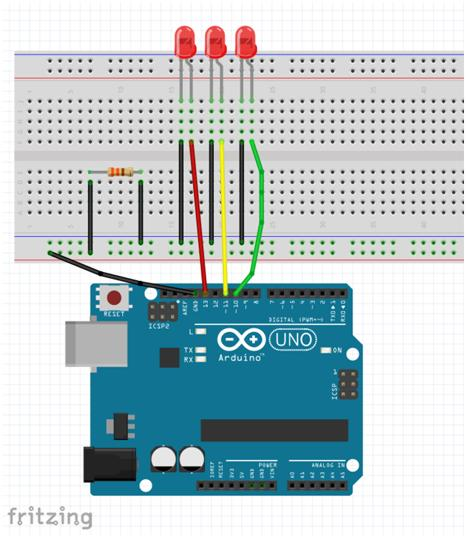

# Semáforo básico con Arduino

Semáforo con 3 estados: Rojo - Verde - Amarillo. Puede hacerse en menos de una hora.

## Materiales necesarios 

* [Arduino IDE](https://www.arduino.cc/en/main/software)
* Arduino Uno (con cable USB para conectarlo al ordenador y transferir el programa)
* 3 leds (rojo, verde, amarillo... curyos pines tienen que ponerse en sentido + y - correcto)
* 1 resistencia de 330 Ohm
* Protoboard y cableado

## Montaje

* Conectar pines Arduino a leds correspondientes.
* Conectar salidas de los leds a entrada de la resistencia y la salida de la resistencia a tierra (están en serie, para evitar que los leds hagan cortocircuito)
* Cargar el programa en el Arduino mediante el cable USB

